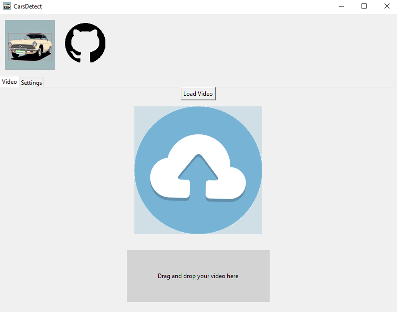
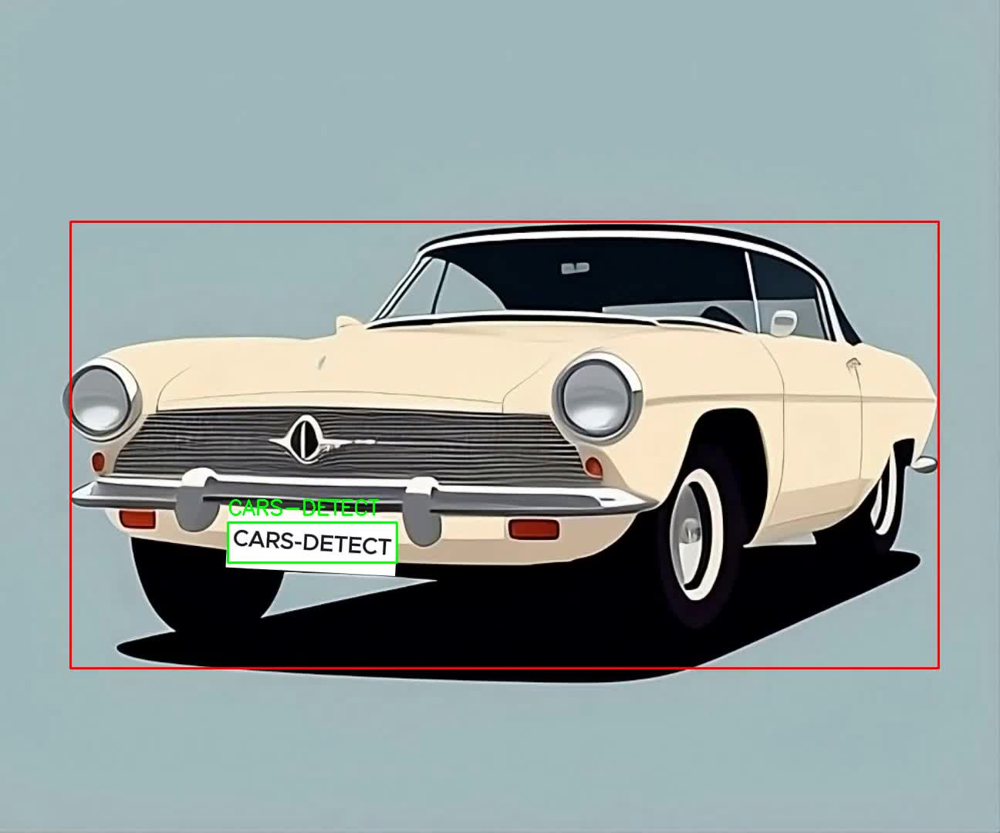

# CarsDetect  

## Description
This program allows you to put a video with one or more cars as input, and the application will automatically detect the cars by framing them, framing the license plates, displaying the plate numbers, etc. (depending on the chosen settings). A rendering window will then open to view it, while the video is being exported to the same folder.

## How to use?

1) Run `main.py`.
2) Drag your video or click the button to import it.
3) Choose your settings in the tab.
4) The renderer will open, and the final video will be created.

## Example Screenshots

### Example 1:

 / 

### Example 2: Several cars framed

- **Input Video:**  
    
- **Resulting Video:**  
  

### Example 3: Framed cars and displayed license plates

- **Input Video:**  
    
- **Resulting Video with Plates:**  
  

## License
Please credit this GitHub project for any use.
